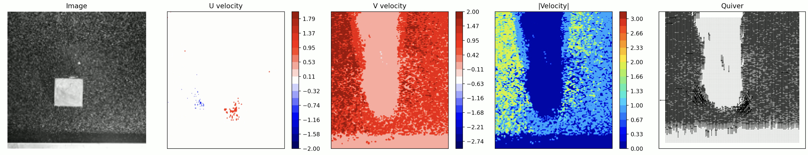
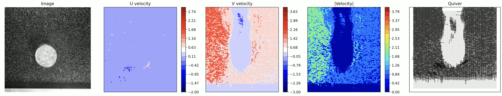
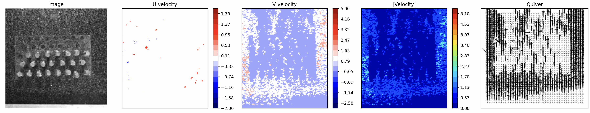
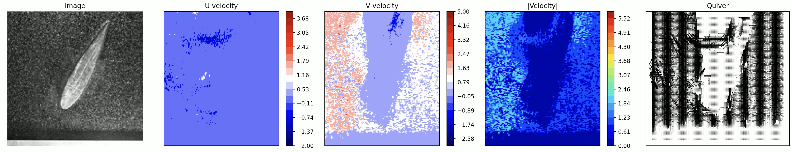

# Parallel Cross-Correlation PIV

This project implements a **parallelized Cross-Correlation algorithm** for Particle Image Velocimetry (PIV), enabling efficient computation of velocity fields from video sequences.

Two different parallel approaches are explored. For detailed methodology and theory, please refer to the accompanying PDF.

---

# Overview

- Extracts velocity components (**U, V**) from video frames  
- Supports both **serial** and **MPI-based parallel implementations**  
- Generates **flow visualizations** (contours + quiver plots)  
- Designed for scalability and performance experimentation  

---

# Workflow

## Step 1: (Optional) Trim Input Video

Reduce the number of frames for faster experimentation:

```
python3 crop_framelength.py \
    --video_path path/to/input.mp4 \
    --video_save_path path/to/output.mp4 \
    --frames <num_frames>
```

## Step 1: Compute Velocity Fields
### Serial Version

```
./cc_serial.out <video_path> <save_U_path> <save_V_path> <save_img_path> <skip>
```

### Parallel Version 1 (MPI)

```
mpirun -np <num_processes> ./cc_p_v1.out \
    <video_path> <save_U_path> <save_V_path> <save_img_path> \
    <skip> <num_threads> <verbose>
```

### Parallel Version 1 (Optimized MPI)

```
mpirun -np <num_processes> ./cc_p_v2.out \
    <video_path> <save_U_path> <save_V_path> <save_img_path> \
    <skip> <num_threads> <verbose>
```

### Example

```
mpirun -np 4 ./cc_p_v2.out \
    clips/airfoil_clip.mp4 \
    Data/airfoil_data/Velocities/U.dat \
    Data/airfoil_data/Velocities/V.dat \
    Data/airfoil_data/Images/img.png \
    1 4 1
```

## Result




